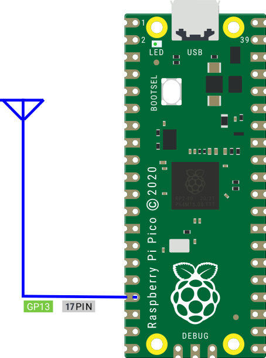

# AM transmitter

Raspberry Pi Pico を小さな放送局にするプログラムです。  
[Tinygo](https://tinygo.org)で、Raspberry Pi Pico のPWMを制御し、AM波の微弱電波を生成して、音楽や報知音等を送信します。  
10cm程度のジャンパー線があればOK、ハードの改造は不要です。  
AMラジオで音楽を聞くことができます。  



## DEMO

準備中

## Features

*AM transmitter* は、PWMで中波帯の微弱電波を生成し、送信します。  
ハードの改造は不要です。PWM出力が可能なGPIO端子に、10cm程度の導電線を接続するだけで、AMラジオから音楽や効果音が流れます。  
特に実用的な用途や技術的な意義はありません。デモなどに利用して下さい。

## Requirement

### Software

* [Tinygo 開発環境](https://tinygo.org/getting-started/install/)

### Hardware

* Raspberry Pi Pico、または、RP2040を搭載した互換マイコンボード
* 10cm程度の導電線(ジャンパーケーブル等)
* 中波放送(AMラジオ放送)のAM波(526.5～1606.5kHz)を受信できるラジオ

## Installation

*AM transmitter* は、tinygoに付属する標準ライブラリのpwm出力の制御機能しか使っていません。  
tinygoの開発環境がきちんと構築されていれば、特に用意するものはありません。  
まだ、tinygoをインストールしていない場合は、以下のガイドを読んで開発環境を構築してください。  

[Tinygo Quick install guide](https://tinygo.org/getting-started/install/)

以下のコマンドで、必要なファイル一式をローカルディレクトリにコピーして下さい。  

```bash
git clone https://github.com/triring/AMtransmitter
cd AMtransmitter
```
## Usage

1. Raspberry Pi Picoの17Pin(GPIO13)に、10cm程度の長さのジャンパーケーブルを接続してください。


2. AMラジオの電源を入れ、周波数を999KHzに合わせてください。

3. uf2ディレクトリ内にある 任意のuf2ファイルをRaspberry Pi Picoに書き込んで下さい。
ラジオから楽曲や効果音が聞こえるはずです。

```bash
> tree /a /f ./uf2
+---effects
|       Jihou.uf2
|       PiPo.uf2
|       ThiroriSound.uf2
|       Ultraman.uf2
|       WestminsterChimes.uf2
|
\---music
        Famima.uf2
        Ievan_polkka.uf2
        KimiGaYo.uf2
        KnightRider
        KnightRider.uf2
        Ode_to_Joy.uf2
        ShortShorts.uf2
        WelcomeJapariPark.uf2
```

## Compile

今回のプログラムは、Raspberry Pi Picoの17Pin(GPIO13)をアンテナ出力に設定することを前提として作成しています。  
これ以外のGPIOを使用する場合は、以下のディレクトリにあるmain.goファイルの設定を書き換える必要があります。  

```bash
> tree /a /f effects
+---Jihou
|       main.go
+---PiPo
|       main.go
+---ThiroriSound
|       main.go
+---Ultraman
|       main.go
\---WestminsterChimes
        main.go

> tree /a /f music
+---Famima
|       main.go
+---Ievan_polkka
|       main.go
+---KimiGaYo
|       main.go
+---KnightRider
|       main.go
+---Ode_to_Joy
|       main.go
+---ShortShorts
|       main.go
\---WelcomeJapariPark
        main.go
```

1. 書き換えるファイルと変更するパラメータ  
設定を変更するmain.goファイルを開き、func main()の先頭部分のpinとpwmの定義部分を探して下さい。  

```bash
	pin := machine.GPIO13
	pwm := machine.PWM6 
```

2. 変更内容  
この部分をアンテナ出力に設定するPINに合わせ、以下の表から、使用するGPIOに対応するPWM チャンネルに書き換えて下さい。  

| GPIO  | 0  | 1  | 2  | 3  | 4  | 5  | 6  | 7  | 8  | 9  | 10 | 11 | 12 | 13 | 14 | 15 |
| :---- | -: | -: | -: | -: | -: | -: | -: | -: | -: | -: | -: | -: | -: | -: | -: | -: |
| PWM Ch| 0A | 0B | 1A | 1B | 2A | 2B | 3A | 3B | 4A | 4B | 5A | 5B | 6A | 6B | 7A | 7B |

| GPIO  | 16 | 17 | 18 | 19 | 20 | 21 | 22 | 23 | 24 | 25 | 26 | 27 | 28 | 29 |    |    |
| :---- | -: | -: | -: | -: | -: | -: | -: | -: | -: | -: | -: | -: | -: | -: | -: | -: |
| PWM Ch| 0A | 0B | 1A | 1B | 2A | 2B | 3A | 3B | 4A | 4B | 5A | 5B | 6A | 6B |    |    |

3. コンパイル  
今回は、music/KimiGaYoディレクトリのコードを例として説明します。  
以下のコマンドで、プログラムをコンパイルして下さい。

```bash
> tinygo build -o uf2/music/KimiGaYo.uf2 -target=pico -size short ./music/KimiGaYo
   code    data     bss |   flash     ram
  62540    1540    3184 |   64080    4724
```

4. 実行  
コンパイルが完了すると、uf2/music/KimiGaYo.uf2 というファイルが作られます。これを、Raspberry Pi Pico に書き込んで下さい。  
AMラジオを999KHzにチューニングして、音楽が聞こえてきたら成功です。  
その他のプロジェクトのコンパイルに関しては、build.shを御覧ください。  

## Note

### 出力周波数の変更

今回、公開しているソースコードでは、出力周波数を、999KHzに設定しています。    
main.go ファイルの以下の定義部分です。

```bash
var period uint64 = uint64(1000000000 / 999000)
```

AM放送の周波数帯では、9kHz間隔で割り振られています。この周波数に適合する波長を生成できるPWMの設定を調べたところ、誤差が少なかったのは以下の4つの周波数でした。  

```bash
1000000000	/	693000	=	1443.001443
1000000000	/	999000	=	1001.001001
1000000000	/	1287000	=	777.000777
1000000000	/	1548000	=	645.994832
```

最近の市販ラジオは、電波の周波数を選局、電波から音声を取り出す検波、復調といった一連の受信処理を全てデジタルで行うDSPラジオが主流です。正確な周波数で送信しないとDSPラジオは受信してくれません。  
必要に応じて、上記の周波数の中から適切なものを選び、period に設定してから、コンパイルして下さい。  
なお、同調回路がコイルとバリコンで構成された昔ながらのアナログラジオであれば、周波数の設定に気を使う必要はありません。  

**注意**  
---
    もし、使用する出力周波数が地元放送局の周波数と被るようであれば、必ず修正してから使用して下さい。  
---

### 新しい楽曲の作り方  

1. 新しいディレクトリを作り、Templatesディレクトリの中身をすべてコピーする。
この中のTemplates.goのファイル名をディレクトリと同じファイル名にする。

```bash
mkdir NewMusic
cp Templates/*.* NewMusic/
mv NewMusic/Templates.go NewMusic/NewMusic.go
```
2. NewMusic/main.goを開く。  
以下の設定を変更し、出力する周波数を設定する。(693,999,1287,1548KHz)

```bash
var period uint64 = uint64(1000000000 / 999000)
```
3. NewMusic/NewMusic.goを開く。  

* Song_BPMの設定  
楽曲に合わせてテンポを書き換える。    
```bash
var Song_BPM float64 = 120.0 // 楽曲のテンポ
```


* Repetitionsの設定
    * 1度だけの演奏は1を設定する。
    * 繰り返して演奏する場合は、その回数を設定する。
    * 永久に演奏を繰り返す場合は0を設定する。
```bash
var Repetitions int = 5      // 繰返しの回数,0と定義すると、無限ループになり、永久に演奏を繰り返す。
```

3. 楽譜データ  

NewMusic/NewMusic.go 内のNotes配列に、楽譜データを書き込んで下さい。  
音階、音長の2つを1組として書き込んでいきます。休符は、Rです。  
音階、音長の定義は、note.goを御覧ください。  

```bash
// 楽譜データ
var Notes = []Note{
	{C4, L4}, // ド
	{D4, L4}, // レ
	{E4, L4}, // ミ
	{F4, L4}, // ファ
	{G4, L4}, // ソ
	{A4, L4}, // ラ
	{B4, L4}, // シ
	{C5, L2}, // ド
	{R, L1},  // 休符
}
```

## Author

* @triring

## License

### 基本ライセンス  
*AM transmitter* is under [MIT license](https://en.wikipedia.org/wiki/MIT_License).

### 追加ライセンス

[Poul-Henning Kamp](https://people.freebsd.org/%7Ephk/) 氏が提唱しているBEER-WAREライセンスを踏襲し配布する。  

### "THE BEER-WARE LICENSE" (Revision 42)

<akio@triring.net> wrote this file. As long as you retain this notice you
can do whatever you want with this stuff. If we meet some day, and you think this stuff is worth it, you can buy me a beer in return.
Copyright (c) 2024 Akio MIWA @triring  

### "THE BEER-WARE LICENSE" (第42版)

このファイルは、<akio@triring.net> が書きました。あなたがこの条文を載せている限り、あなたはソフトウェアをどのようにでも扱うことができます。
もし、いつか私達が出会った時、あなたがこのソフトに価値があると感じたなら、見返りとして私にビールを奢ることができます。  
Copyright (c) 2024 Akio MIWA @triring  
