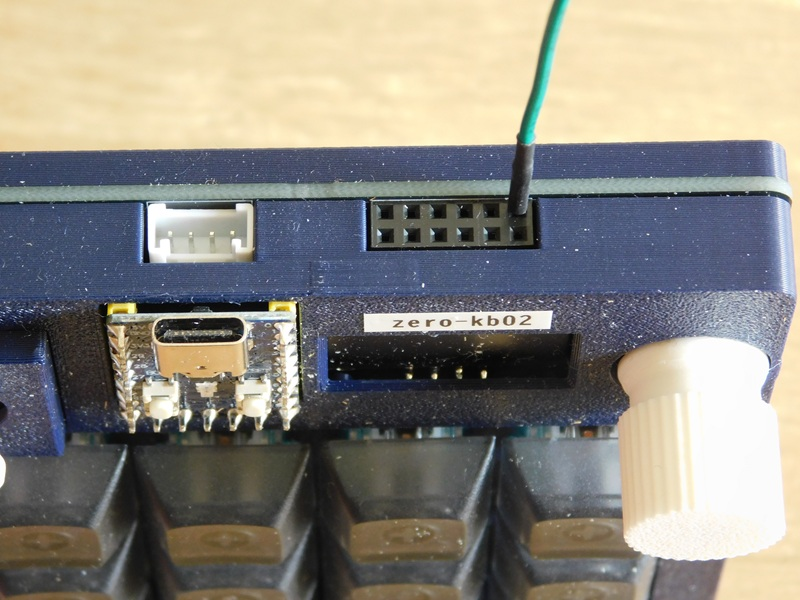
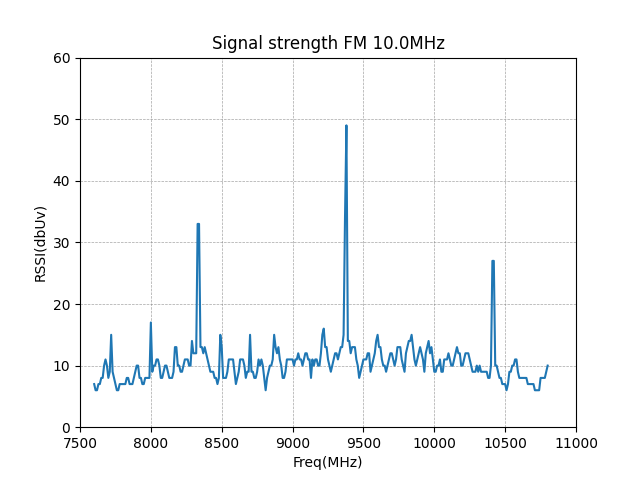

# tinygo tx  


Raspberry Pi Pico を小さな放送局にするプログラムです。  
[Tinygo](https://tinygo.org)で、Raspberry Pi Pico のPWMを制御し、AMやFMラジオで受信できる微弱電波を生成して、音楽や報知音等を送信します。  
10cm程度のジャンパー線があればOK、ハードの改造は不要です。  
元々は、中波帯のAMラジオをターゲットとして [AMtransmitter](https://github.com/triring/AMtransmitter)
というアプリを作成していました。  
しかし、AM放送は、設備更新や維持にかかるコストの削減などを目的として、段階的にFM放送への転換や併用を進めています。2028年秋までに全国の民放AMラジオ局の多くがFM局に移行する見通しです。  
このような情勢から、今後は、AMラジオ局のシェアはどんどん低下していくので、AMの受信機能を持つラジオはどんどん少なくなっていくと思われます。  
逆に、以下の事例のように、FM受信専用のラジオが増えてくると思われます。

* 最近の小中学生の電気工作教材として販売されている組み立て式ラジオもワイドFM対応
* ラジオ機能が組み込まれているスマホは、FM受信専用

そこで、AMラジオに特化していたこのアプリの設定等を見直すことで、超短波帯のFMラジオでも受信可能な微弱電波も生成するようにバージョンアップしたので、Tinygo_TXに改名しました。  
TX は、Transmitter (送信機）の略です。


写真は、Raspberry Pi Pico と同じRP2040チップを搭載したマイコンボード[RP2040-Zero](https://www.waveshare.com/wiki/RP2040-Zero)で作られたマイクロパッド[zero-kb02](https://github.com/sago35/tinygo_keeb_workshop_2024/blob/main/buildguide.md)
です。機能的には互換品なのでデモ用として使用しました。

## DEMO

以下は、RP2040で999KHzの電波を送信し、AMラジオで受信しているデモです。  

[](https://youtu.be/EvfH8MqYdDI)  

[RP2040RadioStation:Tinygo+RP2040で，AMラジオを鳴らす](https://youtu.be/EvfH8MqYdDI)

## Features

*tinygo_tx* は、PWMで中波帯から超短波帯の微弱電波を生成し、送信します。  
ハードの改造は不要です。PWM出力が可能なGPIO端子に、10cm程度の導電線を接続するだけで、AM/FMラジオから音楽や効果音が流れます。  
特に実用性や技術的な意義はありません。  
校歌や社歌のデータを入力し、デモやネタとして使って下さい。  

## Requirement

### Software

* [Tinygo 開発環境](https://tinygo.org/getting-started/install/)

### Hardware

* Raspberry Pi Pico、または、RP2040を搭載した互換品のマイコンボード
* 10cm程度の導電線(ジャンパーケーブル等)
* 以下の周波数帯を受信可能なラジオ  
        - 中波放送(AMラジオ放送)のAM波(526.5～1606.5kHz)を受信できるもの  
        - 超短波放送(FMラジオ放送)のFM波(76.0～108.0MHz)を受信できるもの  

## Installation

*tinygo_tx* は、tinygoに付属する標準ライブラリのpwm出力の制御機能しか使っていません。  
tinygoの開発環境がきちんと構築されていれば、特に用意するものはありません。  
まだ、tinygoをインストールしていない場合は、以下のガイドを読んで開発環境を構築してください。  

[Tinygo Quick install guide](https://tinygo.org/getting-started/install/)

以下のコマンドで、必要なファイル一式をローカルディレクトリにコピーして下さい。  

```bash
        git clone https://github.com/triring/tinygo_tx
        cd tinygo_tx
```
## Usage

最初に、AMラジオで聴取する方法を解説します。  

1. Raspberry Pi Picoの20Pin(GPIO15)に、長さ10cm程度のジャンパーケーブルを接続してください。




写真はRP2040チップを搭載したマイコンボード[RP2040-Zero](https://www.waveshare.com/wiki/RP2040-Zero)で作られたマイクロパッド[zero-kb02](https://github.com/sago35/tinygo_keeb_workshop_2024/blob/main/buildguide.md)の拡張ポートのGPIO15に差し込まれた
アンテナ用のジャンパーワイヤー  

3. ./uf2/demoディレクトリ内にある 任意のuf2ファイルをRaspberry Pi Picoに書き込んで下さい。  

* AM????HKz.uf2は、AMラジオ用です。  
* FM????MKz.uf2は、FMラジオ用です。  

```bash
        > tree /a /f .
        +---uf2
            +---demo
                    AM999KHz.uf2
                    FM083_4MHZ.uf2
                    FM093_8MHZ.uf2
                    FM104_1MHZ.uf2
```

3. ラジオの電源を入れ、書き込んだuf2ファイル名の周波数に合わせてください。    
ラジオから、音楽が聞こえるはずです。  

  


## Compile

今回のプログラムは、Raspberry Pi Picoの20Pin(GPIO15)をアンテナ出力に設定することを前提として、AM帯の周波数を生成する設定になっています。  
これ以外のGPIOや他の周波数を使用する場合は、設定を書き換える必要があります。  
それぞれのディレクトリにあるmain.goファイルを開いて、設定を書き換えて下さい。

```bash
        > tree /a /f effects
        +---CTUringtone
        |       main.go
        +---Jihou
        |       main.go
        +---Kingyo
        |       main.go
        +---PiPo
        |       main.go
        +---Ramen
        |       main.go
        +---Saodake
        |       main.go
        +---ThiroriSound
        |       main.go
        +---Ultraman
        |       main.go
        \---WestminsterChimes
                main.go


        > tree /a /f music
         +---CheCheKoolay
        |       main.go
        +---Famima
        |       Famima.go
        +---Ievan_polkka
        |       main.go
        +---KimiGaYo
        |       main.go
        +---KnightRider
        |       main.go
        +---Ode_to_Joy
        |       main.go
        +---ShortShorts
        |       main.go
        \---WelcomeJapariPark
                main.go

```

### 書き換えるファイルと変更するパラメータ   

設定を変更するmain.goファイルを開き、GPIOや周波数の設定を変更して下さい。  

#### GPIO端子の設定

1. 変更場所  
func main()の先頭部分のpinとpwmの定義部分を探して下さい。  

```bash
        pin := machine.GPIO15
        pwm := machine.PWM7 
```

2. 変更内容  

この部分をアンテナ出力に設定するPINに合わせ、以下の表から、使用するGPIOに対応するPWM チャンネルに書き換えて下さい。  

| GPIO  | 0  | 1  | 2  | 3  | 4  | 5  | 6  | 7  | 8  | 9  | 10 | 11 | 12 | 13 | 14 | 15 |
| :---- | -: | -: | -: | -: | -: | -: | -: | -: | -: | -: | -: | -: | -: | -: | -: | -: |
| PWM Ch| 0A | 0B | 1A | 1B | 2A | 2B | 3A | 3B | 4A | 4B | 5A | 5B | 6A | 6B | 7A | 7B |

| GPIO  | 16 | 17 | 18 | 19 | 20 | 21 | 22 | 23 | 24 | 25 | 26 | 27 | 28 | 29 |    |    |
| :---- | -: | -: | -: | -: | -: | -: | -: | -: | -: | -: | -: | -: | -: | -: | -: | -: |
| PWM Ch| 0A | 0B | 1A | 1B | 2A | 2B | 3A | 3B | 4A | 4B | 5A | 5B | 6A | 6B |    |    |

#### 出力周波数の設定

1. 変更場所  
func main()の先頭部分の搬送波の周波数を定義している行を探して下さい。  

```bash
        var period uint64 = AM0999KHz
```

この定義の前に定義されている周波数を選んで、書き換えて下さい。
なお、AM帯とFM帯で設定方法が少し異なります。

2. FM帯の設定

最初に、pwmでFM放送の周波数帯の電波を、直接、生成しようとしましたが、上手く行きませんでした。  
そこで、出力する周波数の整数倍の高次に発生する高調波（こうちょうは）がFM帯に入る周波数を探しました。  
以下は、FM帯の設定例で、83.40 MHz, 93.80 MHz, 104.10 MHzの3つの周波数で電波が出力されます。  
FM帯の高い周波数では、PWMの設定値の制約から断続時間が長くなり、ノイズが混じるので、10MHz前後の設定を推奨します。


```bash
        var period uint64 = FM010_00MHz
```

  

以下の設定の中で、もっとの出力が高かったのは、FM010_00MHzの設定で、93.80MHzで受信した時でした。  

**FM波設定表**  

|FM波の定義|設定値|出力周波数(MHz)|高調波 1|高調波 2|高調波 3|高調波 4|高調波 5|高調波 6|高調波 7|
|:----|----:|----:|----:|----:|----:|----:|----:|----:|----:|
|FM004_00MHz|250|4.000|76.70|80.60|84.60|88.70|92.80|96.80|100.80|
|FM005_20MHz|192|5.208|78.20|83.40|88.60|93.80|99.00|104.10| |
|FM010_00MHz|100|10.000|83.40|93.80|104.10| | | | |
|FM020_00MHz|50|20.000|83.40|104.10| | | | | |
|FM025_00MHz|40|25.000|80.10|100.00| | | | | |
|FM031_25MHz|32|31.250|93.80| | | | | | |
|FM041_67MHz|24|41.666|83.40| | | | | | |

3. AM帯の設定

AM放送の周波数帯では、それぞれの放送局に割り当てられる周波数は、9kHz間隔で割り振られています。    
最近の市販ラジオは、電波の周波数を選局、電波から音声を取り出す検波、復調といった一連の受信処理を全てデジタルで行うDSPラジオが主流です。  
正確な周波数で送信しないとDSPラジオは受信してくれません。  

そこで、この条件に適合する周波数を生成できるPWMの設定を調べたところ、誤差が少なかったのは以下の表に示す周波数でした。  
必要に応じて、これらの周波数の中から適切なものを選び、period に設定してから、コンパイルして下さい。  
なお、同調回路がコイルとバリコンで構成された昔ながらのアナログラジオであれば、周波数の設定に気を使う必要はありません。  

**AM波設定表**  

|AM波の定義|設定値|出力周波数(KHz)|
|:---------|-----:|--------------:|
|AM0612KHz | 1634 |  611.9951040  |
|AM0684KHz | 1462 |  683.9945280  |
|AM0693KHz | 1443 |  693.0006930  |
|AM0738KHz | 1355 |  738.0073801  |
|AM0774KHz | 1292 |  773.9938080  |
|AM0819KHz | 1221 |  819.0008190  |
|AM0999KHz | 1001 |  999.0009990  |
|AM1224KHz |  817 | 1223.9902081  |
|AM1269KHz |  788 | 1269.0355330  |
|AM1287KHz |  777 | 1287.0012870  |
|AM1368KHz |  731 | 1367.9890561  |
|AM1548KHz |  646 | 1547.9876161  |

### コンパイル  

今回は、music/KimiGaYoディレクトリのコードを例として説明します。  
以下のコマンドで、プログラムをコンパイルして下さい。

```bash
        > tinygo build -o uf2/music/KimiGaYo.uf2 -target=pico -size short ./music/KimiGaYo
        code    data     bss |   flash     ram
        62540    1540    3184 |   64080    4724
```

### 実行  

コンパイルが完了すると、uf2/music/KimiGaYo.uf2 というファイルが作られます。これを、Raspberry Pi Pico に書き込んで下さい。  
ラジオを設定した周波数にチューニングして、アンテナ線の近くに置いて下さい。  
音楽が聞こえてきたら成功です。  
その他のプロジェクトのコンパイルに関しては、build.shを御覧ください。  

### 注意事項  

---
> もし、使用する出力周波数が**地元放送局の周波数と被る**ようであれば、必ず**修正してから使用**して下さい。  
---

## 新しい楽曲の作り方  

1. 新しいディレクトリを作り、Templatesディレクトリの中身をすべてコピーする。
この中のTemplates.goのファイル名をディレクトリと同じファイル名にする。

```bash
        mkdir NewMusic
        cp Templates/*.* NewMusic/
        mv NewMusic/Templates.go NewMusic/NewMusic.go
```

2. NewMusic/main.goを開く。  
以下の設定を変更し、出力する周波数を設定する。(693,999,1287,1548KHz)

```bash
        var period uint64 = uint64(1000000000 / 999000)
```

3. NewMusic/NewMusic.goを開く。  

* Song_BPMの設定  

楽曲に合わせてテンポを書き換える。  

```bash
        var Song_BPM float64 = 120.0 // 楽曲のテンポ
```

* Repetitionsの設定  

* 1度だけの演奏は1を設定する。  
* 繰り返して演奏する場合は、その回数を設定する。  
* 永久に演奏を繰り返す場合は0を設定する。  

    以下は、5回繰り返して演奏する設定  

```bash
        // 繰返しの回数,0と定義すると、無限ループになり、永久に演奏を繰り返す。
        var Repetitions int = 5
```

4. 楽譜データ  

NewMusic/NewMusic.go 内のNotes配列に、楽譜データを書き込んで下さい。  
音階、音長の2つを1組として書き込んでいきます。休符は、Rです。  
音階、音長の定義は、note.goを参照ください。  

```bash
        // 楽譜データ
        var Notes = []Note{
                {C4, L4}, // ド,　4分音符
                {D4, L4}, // レ,　4分音符
                {E4, L4}, // ミ,　4分音符
                {F4, L4}, // ファ,4分音符
                {G4, L4}, // ソ,　4分音符
                {A4, L4}, // ラ,　4分音符
                {B4, L4}, // シ,　4分音符
                {C5, L2}, // ド,　2分音符
                {R, L1},  // 全休符
        }
```

5. コンパイル  

以下のコマンドでコンパイルして下さい。

```bash
        tinygo build -o [出力するuf2ファイル名] -target=pico -size short ./[ソースコードが格納されたディレクトリ名]
```
## 追記事項

ラジオを持っていない方は、このソフトは使えませんよね。  
でも、良い方法があります。  
日頃から、「君のような勘のいいガキは嫌いだよ。」と言われているような方々はお気づきかも知れませんが、下図のように、圧電スピーカー(圧電サウンダー)をGPIO15とGNDに接続すると、音が鳴ります。  
手元に圧電スピーカーがある方は、ぜひ試して見てください。  

  

## warning

**- 警告 -**

このシステムで、以下のような事をしてはいけません。

* 送信出力を上げる。
* 大きなアンテナに接続する。

3mの距離における電界強度が、500μV/mを上回ると電波法違反になります。
あくまでも、「マイコンボードの近くにラジオを置いたら、ノイズが聞こえた。」くらいの範囲で運用して下さい。

## Author

* @triring

## License

### 基本ライセンス  

*tinygo_tx* is under [MIT license](https://en.wikipedia.org/wiki/MIT_License).

### 追加ライセンス

[Poul-Henning Kamp](https://people.freebsd.org/%7Ephk/) 氏が提唱しているBEER-WAREライセンスを踏襲し配布する。  

### "THE BEER-WARE LICENSE" (Revision 42)

<akio@triring.net> wrote this file. As long as you retain this notice you
can do whatever you want with this stuff. If we meet some day, and you think this stuff is worth it, you can buy me a beer in return.
Copyright (c) 2024 Akio MIWA @triring  

### "THE BEER-WARE LICENSE" (第42版)

このファイルは、<akio@triring.net> が書きました。あなたがこの条文を載せている限り、あなたはソフトウェアをどのようにでも扱うことができます。
もし、いつか私達が出会った時、あなたがこのソフトに価値があると感じたなら、見返りとして私にビールを奢ることができます。  
Copyright (c) 2025 Akio MIWA @triring  
